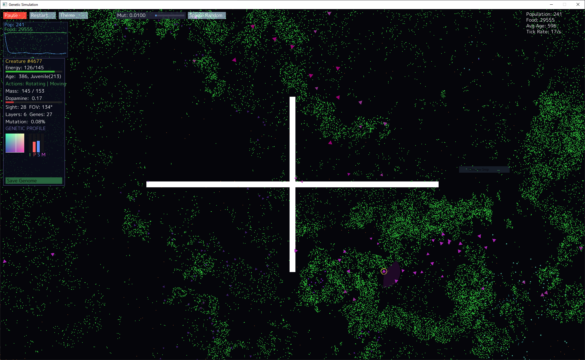

## BioGo

This is a simple genetic simulator written in Go.

Heavily inspired by https://github.com/davidrmiller/biosim4/tree/main/src

#### About

This project simulates natural selection and genetic inheritence.



Creatures in this simulation have:
- A set of possible sensors for the world (Population ahead, last move direction, boundaries...)
- A set of possible actions (Move, rotate, rest, etc...)
- A set of traits (Mass, responsiveness, energy level...)

Most importantly, creatures have a Genome, which encodes traits as well as a slice of genes that define connections between Sensors and Actions via a Neural network.

A genome may look something like this:\

```
00101011|01001010|00000111|11110110|01010000|1|00000010|0|00000110|1|10110110|10000111|1|10110110|0|01110001|10101110
```
where each section of bits represents a single characteristic:\
```
OscPeriod|Mass|SightDistance|Responsiveness|MutationRate|ReproductionType|NeuronCount|BrainLength|...NeuralGenes
```
with neural genes representing a neural pathway:
```
SourceType|SourceID|SinkType|SinkID  |Weight
----------|--------|--------|--------|--------
         0|00000110|       1|10110110|10000111
         1|10110110|       0|01110001|10101110
```

In the simple case above, we create a simple neural network with three neurons:
```
    |--------|    weight   |--------|   weight    |--------|
    | Sensor |---10000111->| Neuron |--10101110-->| Action |
    |--------|             |--------|             |--------|
```

Once initialised, the creature then uses this Neural network to behave in the world. 

Features
- Asexual Reproduction
    - When a certain energy threshold is reached, and creatures have enough mass, they may asexually reproduce, splitting in two. 
- Genetic Evolution
    - Currently not particularly biologically accurate - but when asexually reproducing, there's a minor chance that a mutation occurs in a gene via a random bit flip. Mutations can change characteristics such as a trait, but may also change the neural connections, or even change the size or wiring of the brain. 
- Hebbian Learning
    - To reward energy gain and reproduction, creatures gain dopamine when performing actions that gain energy or reproduce
    - At the expense of energy, weights of the NNet will then update as neurons fire together. These decay over time.
- 

### Install
`
cd biogo/
go run .
`
Parameters can be adjusted in biogo/v2/simulation/parameters.go
#### Requirements
Go 1.15

Dependencies:
- github.com/hajimehoshi/ebiten
- github.com/hajimehoshi/ebiten/v2
- golang.org/x/exp
- golang.org/x/image

#### TODO

- Sexual Reproduction
- Code cleanup & refactor
- Split UI and world space interfaces
- Gene editing?
